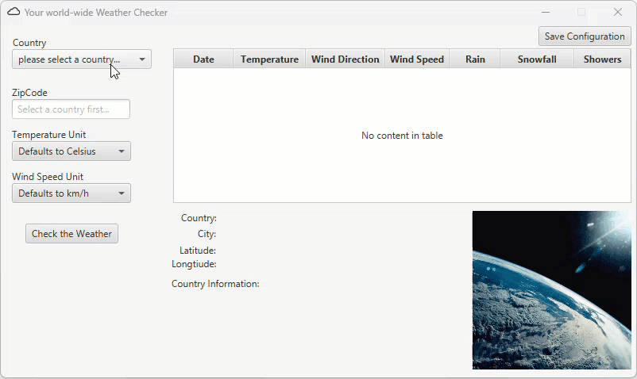

# 🌦️ Weather Forecast Application
## Spring 2025 Java Final Project

## Overview

This is a simple yet functional weather application that uses **two APIs**—[Open-Meteo](https://open-meteo.com/) and [Zippopotam.us](https://api.zippopotam.us)—to fetch and display weather data. The project was developed over the course of five days.

It provides weather forecasts in both **console-based** and **JavaFX graphical user interface (GUI)** formats.

---

## 📌 What Does It Do?

The application allows the user to:

✅ Enter a ZIP code and country code  
✅ Retrieve **latitude, longitude, city, and country information**  
✅ View an image and basic details about the country  
✅ Display a **7-day weather forecast** including temperature, wind speed, and conditions

The forecast is available for **multiple countries** by leveraging ZIP codes via the Zippopotam.us API and weather data via the Open-Meteo API.

Both a **console version** and a **JavaFX GUI version** are provided.

---

## 🚀 How to Use

### Console Application

While primarily intended for testing purposes, the console version allows you to:

1. Enter a **valid country code** (as used by Zippopotam.us)
2. Enter a **ZIP code** for that country
3. Choose a **temperature unit** (Celsius/Fahrenheit)
4. Choose a **wind speed unit** (e.g., mph, km/h)

⚠️ The console interface is minimal and designed mainly for backend testing.

---

### JavaFX GUI Application

For the full user experience:

1. Select a **country** from the dropdown menu
2. Enter a valid **ZIP code**
3. Choose your **temperature unit** from the dropdown
4. Choose your **wind speed unit** from the dropdown
5. Click **"Generate Forecast"**

➡️ The application will display a **7-day weather forecast** in a table format, based on your selected location.

It will also show the **latitude, longitude, city, country name, a country image**, and some additional country details.

---

## 🗺️ UML Design

Below is the UML diagram for the project design:


---

## 🎥 Screen Recording

A short demo of the app in action:



---

## ✨ Project Highlights

- ✅ Uses **two APIs** to chain data (location → weather)
- ✅ Supports **multiple countries**
- ✅ Provides both **console-based** and **GUI-based** interactions
- ✅ Displays **detailed weather data** alongside **location metadata**

---

## 🚀 How to Run the Application

1. **Clone the repository:**
   ```bash
   git clone https://github.com/ThePresidentofTheUniverse/WeatherProgramWithAPI.git

Feel free to explore the source code, leave feedback, or fork the project!
